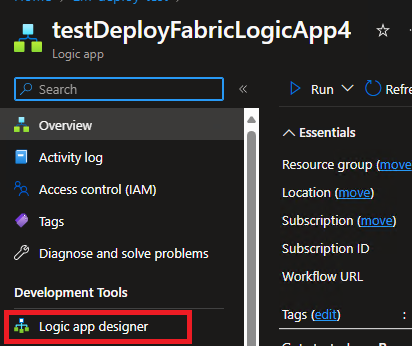
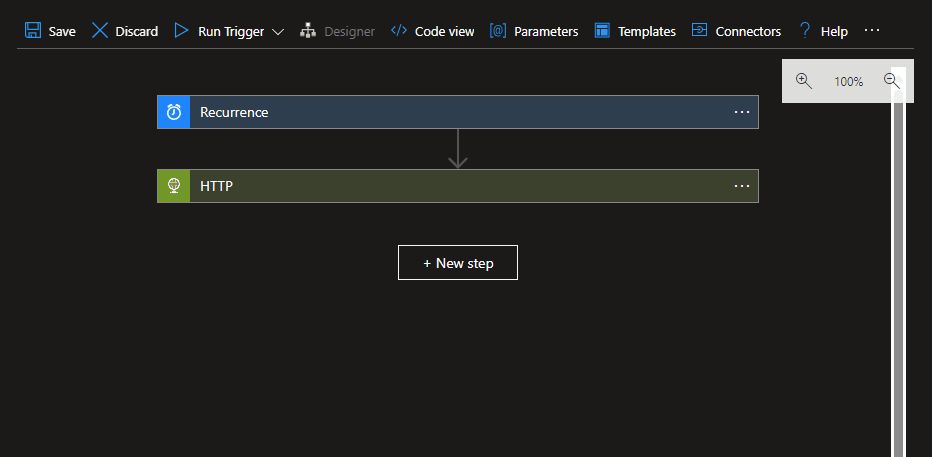
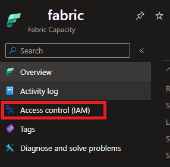
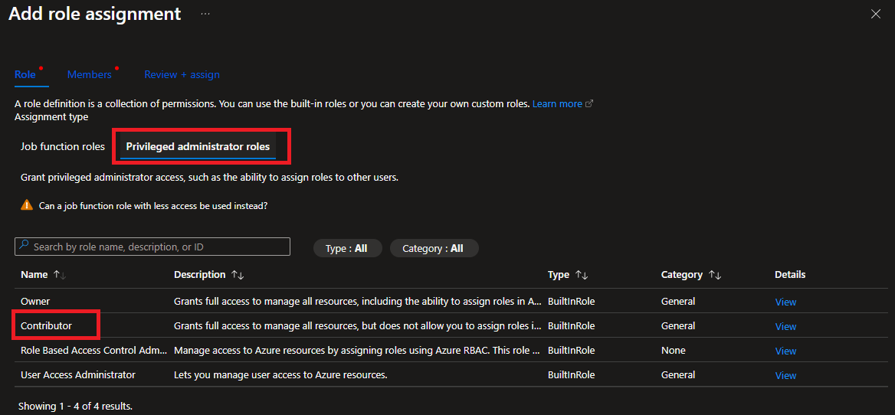
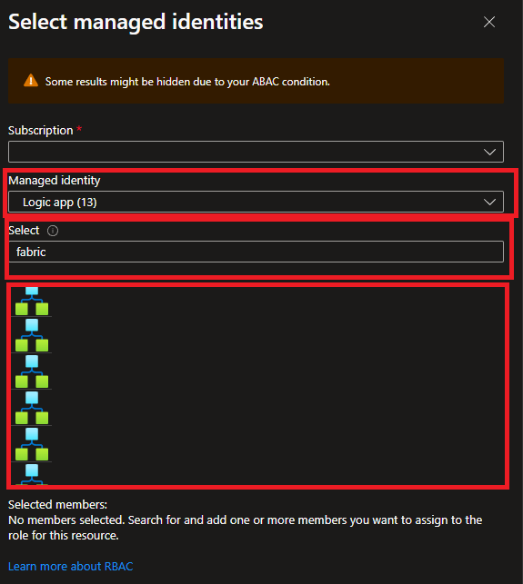
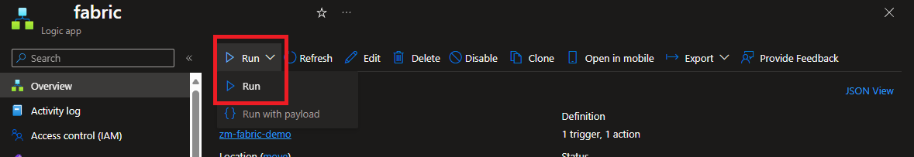

# Auto Suspend/Resume Fabric Capacity Using Logic Apps

## Repository Purpose
This repository is meant to demonstrate how a Fabric Capacity could automatically be suspended or resumed on a schedule through the usage of Logic Apps. This could be helpful in development or trial scenarios. For example, if you have a capacity running in an Azure Tenant with the Visual Studio credit in place.

## DISCLAIMER
I am a Microsoft employee working in the Customer Success space. I am not in engineering so nothing in this repository is representative of endorsed best practices. All items in the repository are meant for learning and should not be treated as production code.

## Install Insructions
1. Follow this link while signed into a browser that can access your Azure Tenant.

    

2. Input values for the parameters. 

    - Tooltips describe what the parameter is expecting.

        

    - You can quickly find SubscriptionId, Resource Group, and Capacity Name in by viewing the Fabric Capacity Resource in Azure.

        
    
    - Only change the Resource Group parameter value if you need to deploy to a region not in the Resource Group where you're deploying the Logic App 

3. Once the parameters in, click Review+Create and finish the deployment. 
4. Upon success, bring up your newly deployed Logic App in the Azure Portal.
5. On the left navigatoion, open up the Logic App Designer.

    

6. In the Logic App Designer, add in the recurrence Time Zone and Hours that meet the criteria for suspending or resuming your Fabric Capacity.

    

7. Go to your Fabric Capacity in the Azure Portal and open the IAM Settings

    

8. Add a new role assignment by clicking "+Add>Add role assignment"
9. Choose the Contributor role by selecting "Priveleged administrator roles" tab and then Contributor. Click Next.

    

10. Choose Managed Identity and then Select Members. 
11. This will open a pane to select a managed identity. Filter the list by selecting Logic app in the Managed Identity list and find the Logic App you just created by its name.

    

12. Return to your logic app in the Azure Portal and click Run.

    

13. If your Logic App completes successfully your Fabric Capacity should be in whichever state you chose to set it to in the trigger!