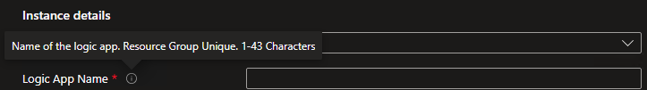
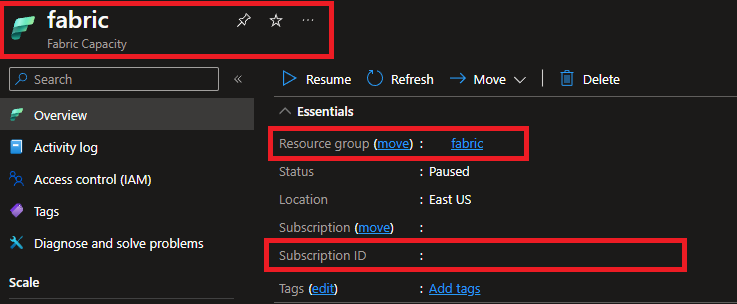

# Auto Suspend/Resume Fabric Capacity Using Logic Apps

## Repository Purpose
This repository is meant to demonstrate how a Fabric Capacity could automatically be suspended or resumed on a schedule through the usage of Logic Apps. This could be helpful in development or trial scenarios. For example, if you have a capacity running in an Azure Tenant with the Visual Studio credit in place.

## DISCLAIMER
I am a Microsoft employee working in the Customer Success space. I am not in engineering so nothing in this repository is representative of endorsed best practices. All items in the repository are meant for learning and should not be treated as production code.

## Install Insructions
1. Follow this link.

    

2. Input values for the parameters. 

    - Tooltips describe what the parameter is expecting.

        

    - You can quickly find SubscriptionId, Resource Group, and Capacity Name in by viewing the Fabric Capacity Resource in Azure.

        
    
    - Only change the Resource Group parameter value if you need to deploy to a region not in the Resource Group where you're deploying the Logic App 

3. 